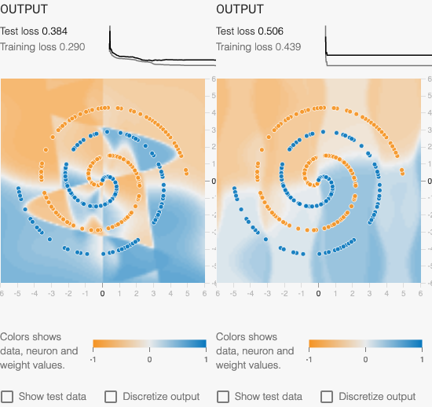
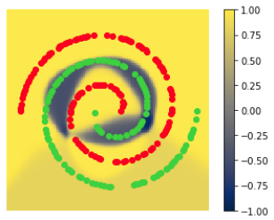

# Natural Computing: Assigment 2

> By Greg Brimble & Paul Georgiou

## Task 1

### 1.1 Fitness Function

We used the following error function when training the neural network:

$$\epsilon = \frac{\sum_{i=1}^{N} \frac{(\text{output}_i - \text{label}_i)^2}{2}}{N}$$

Where:

- $i$ is the index of a particular data point in the training data set,
- $N$ is the total number of data points in the training data set,
- $\text{output}_i$ is the calculated value (between $1$ and $-1$) of the particular data point with index, $i$, and
- $\text{label}_i$ is the expected value (either $1$ or $-1$) of the particular data point with index, $i$.

Although we simply used this error function as a target to minimize, it could, of course, be converted to a fitness function which one would instead try to maximize, by simply using the following:

$$f = 1 - \epsilon$$

### 1.2 Search Space

We defined our neural network as having:

- four inputs:
  - $x$
  - $y$
  - $\text{sin}(x)$
  - $\text{sin}(y)$
- a single hidden layer with six nodes,
- and a single output node.

With each having a bias (11), and the final two layers having a combined 30 weights ($1 * 6 + 6 * 4 = 30$) this creates a search space of 41 dimensions ($11 + 30 = 41$) for our PSO implementation to solve. Note however, that the biases in the four input nodes are not used in the actual calculation, so 'optimizing' these four dimensions has no effect. The 'true' dimensionality of the problem is therefore 37, despite our implementation optimizing for 41.

### 1.3 Results

Our adapted Tensorflow Playground ([original](https://playground.tensorflow.org/)) can be found here: [https://gregbrimble.github.io/playground](https://gregbrimble.github.io/playground). The configuration defaults to using PSO to train the neural network, with 25 particles, $\omega = 0.5, \alpha_1 = 2, \text{and} \alpha_2 = 2$.

With this configuration, Figure \ref{pso_350} renders a sample output after 350 iterations.

{ width=25% }

Figure \ref{pso_1000} clearly demonstrates that no further significant improvements are made to the model beyond approximately 350 iterations.

{ width=25% }

### 1.4 Comparison against Linear Inputs

Restricting the network to only linear inputs ($x$ and $y$) significantly curtails the model's ability to fit to the spiral training data. As seen in Figure \ref{pso_linear}, the minimum training loss is quickly reached, with very little improvement seen with future iterations. The model itself is functionally very simple: practically a 50/50 divide along the spirals' centers.

{ width=25% }

### 1.5 Effect of PSO Parameters

Using a higher $\omega$ value results in stuttered learning (best seen in the loss sparkline) and a generally poorer model, as demonstrated in Figure \ref{pso_08}.

{ width=25% }

Significantly changing $\alpha_1$ and $\alpha_2$ seriously hampered the ability for the model to train. Figure \ref{pso_alphas} demonstrate using $\alpha_1 = \alpha_2 = 1$ (left) and $\alpha_1 = \alpha_2 = 3$ (right).

{ width=50% }

And finally, increasing the number of particles did improve the training and test loss, but begins to show signs of overfitting to the data (Figure \ref{pso_100}).

{ width=25% }

## Task 2

Task 2 was completed in the attached Jupyter Notebook, **not** in the Tensorflow Playground. The neural network itself is trained using a stochastic gradient-descent and had six inputs: the same four as in the PSO task, as well as $x^2$ and $y^2$.

### 2.1 Evolving the Network Structure

To create a neural network which could be structurally evolved with GP, we firmly set the number of hidden layers to 4. Although this sounds like it would be too prescriptive, this value actually operates as an upper limit, where evolution is free to choose the number of nodes in each layer, and if zero or one, the layer is omitted.

The structure is encoded in a simple list of integers representing the width of each hidden layer at that index. For example,
`[2, 3, 1, 4]` has a three hidden layers, with two nodes in the first, three in the second, (the third is omitted), and four in the final.

### 2.2 Further Evolutions

We decided not to do optimizations on the learning rate or batch size. After investigating their effects in the Tensorflow Playground, we selected a constant 0.03 and 8, respectively.

### 2.3 Operators and Parameters of GA and Their Performance

The genetic algorithm uses uniform crossover, with a 90% probability of crossover, and 5% of mutation. We evaluated fitness as follows:

$$f = \frac{1}{1 + \text{MSE}}$$

Where MSE is the mean squared error. In the best performing network we generated, we obtained a mean squared error of 1.719, (fitness of 0.368) and a distinctly spiral-shaped model, as seen in Figure \ref{ga}.

{ width=25% }

### 2.4 Controlling Complexity

Upper limits were placed on the number of hidden layers, 4, and of each layers' width, 8. This helped to constrain the network shape, ensuring it didn't become too complex for the problem.

The neural network pictured in Figure \ref{ga} had a hidden layer network structure of `[1, 3, 8, 7]`. Since the first layer is only one node, it is actually omitted, giving a true structure of `[3, 8, 7]`. Inspecting the nodes in that first hidden layer revealed that one node was highly dependant on the nonlinear inputs, and was primarily responsible for drawing the blue ring seen in the model. This was propagated through the rest of the network, while the rest of the nodes' influences were minimized.

## Task 3

### 3.1 Additional Node Functions

Each node in the expression tree evolved can perform one of four transformation types: A Layer of `tanh` neurons, a mathematical Function, a Concatenation of the outputs of two parent nodes, and provide the Input of the network (terminal node). The root of the tree is always a Layer of width one, as this is a single class problem. The GP algorithm can choose the function (sin or square) and the layer width (1-8 neurons). Using concatenation the algorithm can choose different transformations for parts of the same "layer".

### 3.2 Operators and Parameters of GP and Their Performance

The algorithm can perform crossover and mutation. In crossover, a random sub-tree is selected and swapped for each tree. For mutation, the width of a Layer node and the function of the Function node can be varied.

The obtained performance is poor, as the initial population is unusual (compared to something a human would design) and the fitness metric can vary considerably based on the random initialisation of weights, so the algorithm can't consistently find out the best architectures.

### 3.3 Evolution from scratch or pre-evolved network

In both cases performance is poor as the fitness metric is useless. Hence after a few generations the population will be distorted.

In the current implementation the training epochs are fixed. In addition to the mean squared error, one could consider the minimum number of training epochs needed to reach an acceptable accuracy. The simplicity of a network is also something that needs to be considered when considering which is better e.g. one with fewer layers would be preferred.

### 3.4 Observations related to Cartesian Genetic Programs (CGPs)

The algorithm evolves long-thin architectures as it is limited to 8 neurons in width (but no limit in depth during crossover), however it is not clear whether they are better, as the fitness metric is useless. Empirically we can tell that in the context of neural networks deep architectures are harder to train so we would expect worse performance for simpler problems.

In this implementation crossover is essential as the the mutation that can be made are limited. If more complex mutations were supported, they could mimic crossover by generating random sub-trees and swapping them with existing sub-trees. Hence distinct crossover would not be strictly needed.

### 3.5 Future Work

The most essential improvement would be making the fitness metric accurate. The mean squared error would have to averaged over many runs, something that would require significantly more compute.

We could also add additional operations to the mutation part of the GP algorithm. Examples include growing and shrinking the tree, and changing the node type (e.g. Function to Layer).

To limit the growth of the network we could penalise or hard-limit the size of the network after crossover and mutation.
