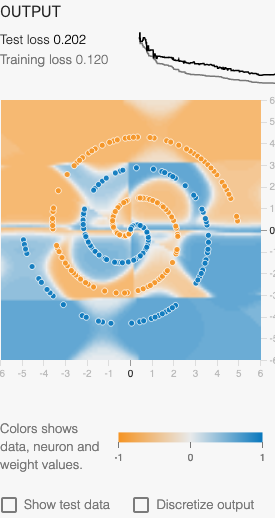
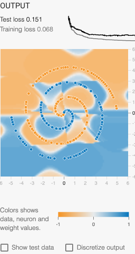

# Natural Computing: Assigment 2

> By Greg Brimble & Paul Georgiou

## Task 1

### 1.1 Fitness Function

We used the following error function when training the neural network:

$$\epsilon = \frac{\sum_{i=1}^{N} \frac{(\text{output}_i - \text{label}_i)^2}{2}}{N}$$

Where:

- $i$ is the index of a particular data point in the training data set,
- $N$ is the total number of data points in the training data set,
- $\text{output}_i$ is the calculated value (between $1$ and $-1$) of the particular data point with index, $i$, and
- $\text{label}_i$ is the expected value (either $1$ or $-1$) of the particular data point with index, $i$.

Although we simply used this error function as a target to minimize, it could, of course, be converted to a fitness function which one would instead try to maximize, by simply using the following:

$$f = 1 - \epsilon$$

### 1.2 Search Space

We defined our neural network as having:

- four inputs:
  - $x$
  - $y$
  - $\text{sin}(x)$
  - $\text{sin}(y)$
- a single hidden layer with six nodes,
- and a single output node.

With each having a bias (11), and the final two layers having a combined 30 weights ($1 * 6 + 6 * 4 = 30$) this creates a search space of 41 dimensions ($11 + 30 = 41$) for our PSO implementation to solve.

### 1.3 Results

Our adapted Tensorflow Playground ([original](https://playground.tensorflow.org/)) can be found here: [https://gregbrimble.github.io/playground](https://gregbrimble.github.io/playground). The configuration defaults to using PSO to train the neural network, with 25 particles, $\omega = 0.5, \alpha_1 = 2, \text{and} \alpha_2 = 2$.

With this configuration, Figure \ref{pso_350} renders a sample output after 350 iterations.

{ width=45% }

Figure \ref{pso_1000} clearly demonstrates that no further significant improvements are made to the model beyond approximately 350 iterations.

{ width=45% }

### 1.4 Comparison against Linear Inputs

Restricting the network to only linear inputs ($x$ and $y$) significantly curtails the model's ability to fit to the spiral training data. As seen in Figure \ref{pso_linear}, the minimum training loss is quickly reached, with very little improvement seen with future iterations. The model itself is functionally very simple: practically a 50/50 divide along the spirals' centers.

{ width=45% }

### 1.5 Effect of PSO Parameters

Using a higher $\omega$ value results in stuttered learning (best seen in the loss sparkline) and a generally poorer model, as demonstrated in Figure \ref{pso_08}.

{ width=45% }

Significantly changing $\alpha_1$ and $\alpha_2$ seriously hampered the ability for the model to train. Figure \ref{pso_3} and \ref{pso_1} demonstrate using $\alpha_1 = \alpha_2 = 3$ and $\alpha_1 = \alpha_2 = 1$ respectively.

{ width=45% }

{ width=45% }

And finally, increasing the number of particles did improve the training and test loss, but begins to show signs of overfitting to the data (Figure \ref{pso_100}).

{ width=45% }

## Task 2

### 2.1 Evolving the Network Structure

### 2.2 Further Evolutions

### 2.3 Operators and Parameters of GA and Their Performance

### 2.4 Controlling Complexity

## Task 3

### 3.1 Additional Node Functions

### 3.2 Operators and Parameters of GP and Their Performance

### 3.3 Comparison with GA

### 3.4 Comparison with Cartesian Genetic Programs (CGPs)

### 3.5 Future Work
